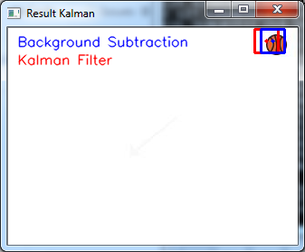
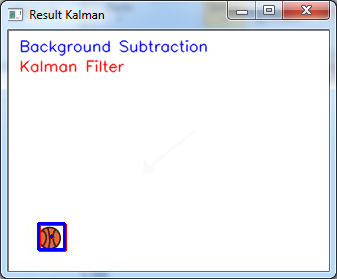

# Linear Kalman Filter for Object Tracking

This repository is an implementation in Python and OpenCV of Linear Kalman Filter for object tracking from 
the book "Kalman Filter for Beginners: with MATLAB Examples".

```
python test_track.py
```
 

References:
- Kalman Filter for Beginners: with MATLAB Examples, Phil Kim
- Learning OpenCV 3 Computer Vision with Python Second Edition, Joe Minichino & Joseph Howse
